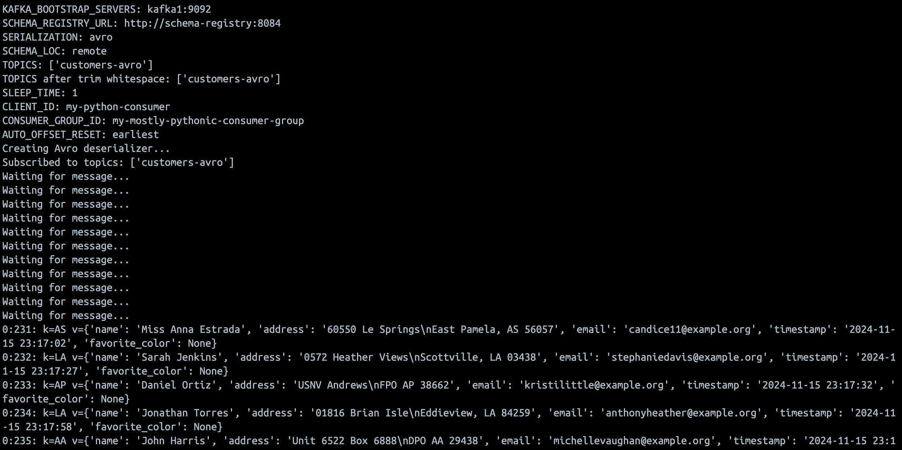

# kafka-consumer

This is the source code for a generic Kafka consumer app written in Python that prints out message with their partition and offset. Works with the Confluent schema registry to deserialize Avro and JSON messages when provided such [config](#config). 

Default settings runs without schemas. The scripts have been built into and published as a Docker image, [stuzanne/kafka-consumer](https://hub.docker.com/r/stuzanne/kafka-consumer).

A supporting docker-compose is present in this repo as an example, including a local Kafka, schema registry, [data generator](https://github.com/Stuzanna/kafka-data-generator) and UI to visualise everything from [Conduktor](https://conduktor.io).  

# Get Started Demo

Run `docker compose up -d` and navigate to [localhost:8080](http://localhost:8080) to see the Kafka topics using the Conduktor UI.

*Messages produced, seen in the Conduktor UI*

*An example message, seen in the Conduktor UI*

# Config

The configuration can be changed by setting environment variables.

| Name | Default | Description |
|------|---------|-------------|
| `KAFKA_BOOTSTRAP_SERVERS` | `localhost:19092` | Kafka broker connection string |
| `SCHEMA_REGISTRY_URL` | `http://localhost:8084` | URL for the Schema Registry service |
| `SERIALIZATION` | None | Type of serialization to use for message handling |
| `SCHEMA_LOC` | None | Location of the schema |
| `SCHEMA_FILE_PATH` | None | File path to the schema definition |
| `TOPICS` | `customers` | Comma-separated list of Kafka topics to consume (whitespace will be trimmed) |
| `SLEEP_TIME` | `1` | Time to sleep between processing each message (in seconds) |
| `CLIENT_ID` | `my-python-consumer` | Identifier for the Kafka consumer client |
| `CONSUMER_GROUP_ID` | `my-mostly-pythonic-consumer-group` | Consumer group identifier for managing partition assignments |
| `AUTO_OFFSET_RESET` | `earliest` | Controls where to start reading messages when no offset is stored |

# Limitations
Security has not been built into this PoC app, must be an Kafka cluster that does not require authentication.

The app is published on [Dockerhub](https://hub.docker.com/r/stuzanne/kafka-consumer).
